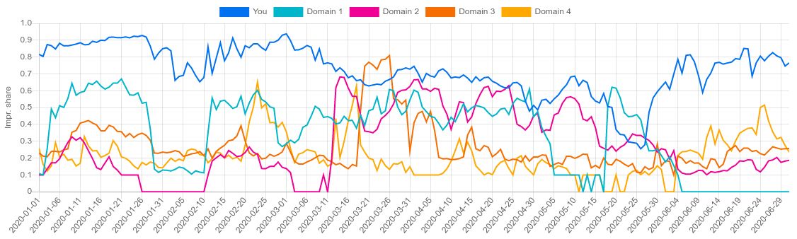
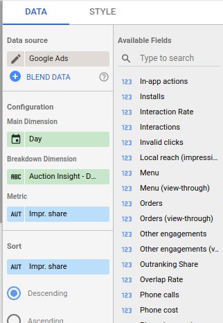

# Auction Insights - Visualization

__Visualize auction insights data over time, broken down by domain, with filtering, directly in Data Studio.__

If you ever tried to visualize auction insights in Data Studio, you might have noticed that time series charts of auction insights metrics (impression share, outranking share, ...), broken down by domain, throw an error when you apply a filter.
This project aims to remedy that by providing a [community visualization](https://developers.google.com/datastudio/visualization) that keeps working and that you can use as a drop-in replacement for the standard time series.

## Setup

  - Open a Data Studio report that uses the [Google Ads connector](https://support.google.com/datastudio/answer/7020275?hl=en), or create a blank report and add your Google Ads account as a data source to that report.

  - Enable community visualizations for the Google Ads connector:
    - Click on __Resource__ > __Manage added data sources__ in the top menu bar.
    - Click on __Edit__ next to the Google Ads connector.
    - Click on __Community visualizations access__ in the upper right corner and switch it to __On__.
    - Click __Save__, followed by __Done__ and __Close__ in the upper right to exit the data sources configuration.
      

  - Add the community visualization to your report:
    - Click on the __Community visualizations and components__ button in the top menu bar (next to __Add a chart__)
    - Click on __+ Explore more__ in the window that pops up.
    - Click on __Build your own visualization__.
    - Enter `gs://time-series-viz/v1` in the field __Manifest path__.
    - Click __Submit__.
    - Click on __Time Series__ and drag the new chart somewhere on your report.
      
    
  - Configure the community visualization as follows (on the tab __Data__):
    - Drag a time dimension (such as __Year__, __Month__, __Week__ or __Day__) to the __Main Dimension__ field.
    - Drag __Auction Insight - Domain__ to the __Breakdown dimension__ field.  
      (Or see [here](#does-this-support-shopping-campaigns) for shopping campaigns)
    - Drag an auction insight metric (such as __Impr. share__) to the __Metric__ field.  
      

Congratulations! You should now have a nice chart as seen above.
At this point, you might want to add filters for a specific campaign or ad group.

## Frequently asked questions

### Does this support Shopping campaigns?

Yes! Just select _Auction Insight - Store display name_ as the breakdown dimension and one of the supported metrics for Shopping (see table below).

|                         | Search                                                                                           | Shopping                                                                          |
|-------------------------|--------------------------------------------------------------------------------------------------|-----------------------------------------------------------------------------------|
| __Main Dimension__      | Day, Week, Month, Year                                                                           | Day, Week, Month, Year                                                            |
| __Breakdown Dimension__ | Auction Insight - Domain                                                                         | Auction Insight - Store display name                                              |
| __Metric__              | Impr. share, Overlap Rate, Outranking Share, Top of page rate, Abs. top of page rate | Shopping impression share, Shopping overlap rate, Shopping outranking share    |

## Hosting it yourself (optional)

If you rather host the visualization yourself (which is totally optional), you can copy it to your own Cloud Storage bucket.
You'll only need to do this the very first time you want to use this visualization in any report.

  - [Create a Cloud Storage bucket](https://cloud.google.com/storage/docs/creating-buckets) in your Google Cloud Platform project, if you don't have one yet.
  - Fill in the variable `CLOUD_STORAGE_BUCKET` in `deploy.sh` based on the name of your bucket.
  - Run `./deploy.sh`. This will copy the visualization code to the specified bucket.
    Note that this command requires that you have [gsutil](https://cloud.google.com/storage/docs/gsutil) installed and working.

At this point, you bucket should contain the files `manifest.json`, `aiViz.json`, `aiViz.js`,  and `aiViz.css`.

## Limitations

  - __Incompatible with data control__  
    Community visualizations are not compatible with the Data Studio data control.
    It is, however, possible to add a filter control with the dimension __Account / description__ to select a specific account amongst the maximum 50 linked accounts.
    
  - __No keyword-level segmentation__  
    Keyword-level insights are not exposed by the Google Ads connector and can thus not be visualized.
    It is, however, possible to add filter controls to select a specific account, campaign, or ad group.
    
    
__This is not an officially supported Google product.__
